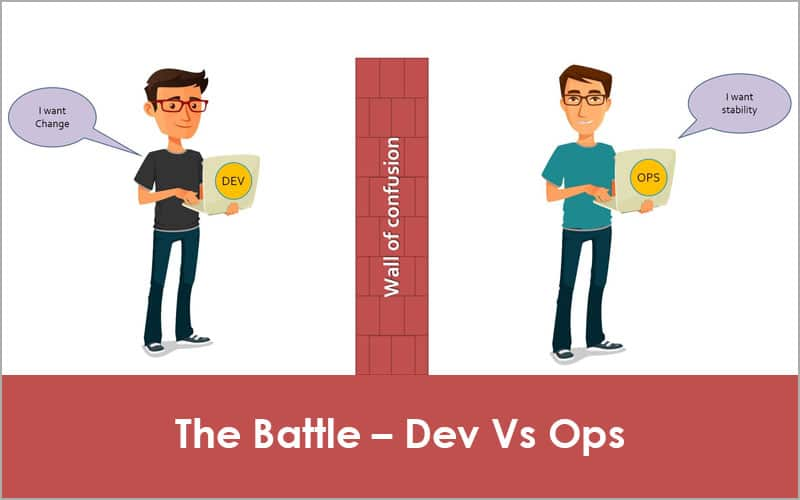
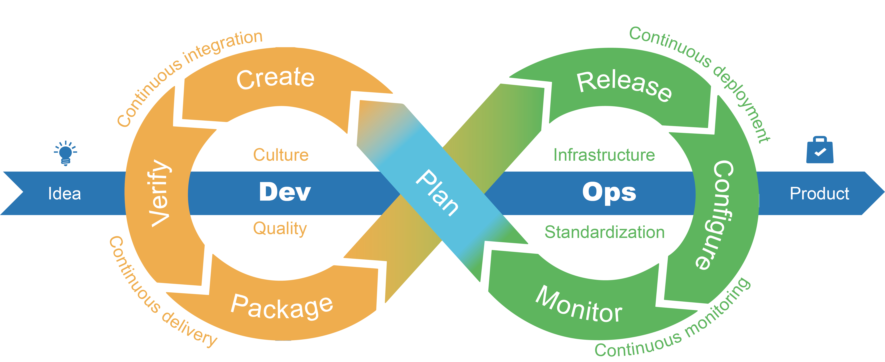

# Organisation de l'unité

## BIM3

- 2H par semaine de théorie
- 2H par semaine de laboratoire

  

    

## BIM4

- 4H par semaine de laboratoire

    

 

 
Planning détaillé disponible sur PoEsi

--- 
 
<!-- _class: cite -->        

L'**évaluation** de l'unité repose sur un contrôle continu combinant un **QCM** pour 25% de la note et la **réalisation de scénarios pratiques** pour 75% de la note. 

---

# DevOps : Contexte et origine

## Problème
Manque de collaboration :
    - Le développement ajoute des nouvelles fonctionnalités.
    - Les opérations garantissent la stabilité du système.

## Solution 
Intégration des pratiques Agile et Lean.

--- 

# Historique du DevOps

- **2007-2008** : Naissance du concept lors d'une discussion sur les pratiques de collaboration entre développement et opérations.
- **2009** : Première conférence DevOpsDays organisée par Patrick Debois.
- **Années 2010** : Adoption croissante par les entreprises pour améliorer la livraison continue et la qualité des logiciels.
- **Aujourd'hui** : DevOps est un standard pour la gestion du cycle de vie des logiciels.

--- 
 
<!-- _class: cite -->        

DevOps est une **culture** et un ensemble de **pratiques** visant à améliorer la collaboration entre les équipes de développement (Dev) et des opérations (Ops).

---

# Principes Clés
- **Automatisation** des processus.
- **Amélioration continue** : **Intégration continue** (CI) et **Livraison continue** (CD).
- **Monitoring**.
- **Collaboration renforcée** entre équipes.

---
# DevOps : Cycle de vie

---

# Outils populaires

### Planification et Collaboration
- **Jira**, **Trello**

### Développement
- **Git**, **SVN**

### Vérification du code
- **xUnit**, **Selenium**, **SonarQube**

### Package et release
- **Docker**

### Intégration et Livraison
- **Jenkins**, **Travis CI**,**GitLab CI/CD**

### Configuration et Orchestration
- **Ansible**, **Puppet**, **Terraform**, **Kubernetes**

### Monitoring
- **Prometheus**, **Grafana**

---        
     
# Matières

      
<!-- _class: cool-list -->

### Dev

1. *Docker et Docker-compose*
2. *Sonarqube*
3. *Gitlab CI/CD*
   

  

    

### Ops

5. *Terraform* 
6. *AWS/Azure/AlwaysData* 
7. *Prometheus*
 

    

 

---

<!-- _class: transition2 -->  

Conteneurisation avec Docker

--- 

# Docker

---
<!-- _class: transition2 -->  

Docker-compose

--- 

         
 

   

 

---
<!-- _class: transition2 -->  

Analyse de la qualité du code 
Sonarqube

--- 

         
 

   

 

---
<!-- _class: transition2 -->  

Définition d'un pipeline 
GitlabCI/CD

--- 

         
 

   

 

---
<!-- _class: transition2 -->  

Gérer l'infrastructure 
Terraform

--- 

         
 

   

 

---
<!-- _class: transition2 -->  

Le monitoring 
Prometheus

--- 

         
 

   

 